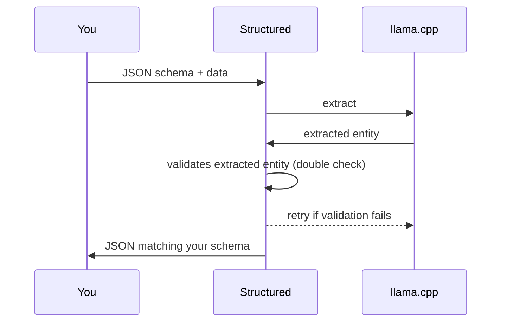

# Structured (work in progress)

Extracts structured data from unstructured input. Programming language
agnostic. Uses [llama.cpp](https://github.com/ggerganov/llama.cpp).

## About Structured

The project started as a Go conversion of https://github.com/jxnl/instructor/,
but evolved in a more general-purpose library.

Structured maps data from arbitrary JSON schema to arbitrary Go struct (or just
plain JSON).

It also features a language-agnostic HTTP server that you can set up in front
of [llama.cpp](https://github.com/ggerganov/llama.cpp).

It is focused on [llama.cpp](https://github.com/ggerganov/llama.cpp). Support
for other vendor APIs (like OpenAI or Anthropic) might be added in the future.

### Key Features

1. Language-agnostic HTTP server
2. Go library with a simple API
3. Model agnostic
4. Focused on [llama.cpp](https://github.com/ggerganov/llama.cpp)

## Installation

Download the latest release from the
[releases page](https://github.com/distantmagic/structured/releases).

Alternatively you can clone the repository and build it yourself:

```shell
git clone git@github.com:distantmagic/structured.git
cd structured
go build
```

## How It Works



## HTTP API

Start a server and point it to your local
[llama.cpp](https://github.com/ggerganov/llama.cpp) instance:

```shell
./structured \
	--llamacpp-host 127.0.0.1 \
	--llamacpp-port 8081 \
	--port 8080
```

Structured server connects to
[llama.cpp](https://github.com/ggerganov/llama.cpp) to extract the data.

### Extract Entity

Include `schema` and `data` in your POST body.
The server will respond with JSON matching your schema:

```
Request:
POST http://127.0.0.1:8080/extract/entity
{
  "schema": {
    "type": "object",
    "properties": {
      "hello": {
        "type": "string"
      }
    },
    "required": ["hello"]
  },
  "data": "Say 'world'"
}

Response:
{
  "hello": "world"
}
```

## Programmatic Usage

Instead of using the HTTP API, you can use the Go library directly.

API can change with time until all features are implemented.

### Initializing the Mapper

Point it to your local [llama.cpp](https://github.com/ggerganov/llama.cpp)
instance:

```go
import (
	"fmt"
	"net/http"
	"testing"

	"github.com/distantmagic/structured/structured"
	"github.com/distantmagic/paddler/llamacpp"
	"github.com/distantmagic/paddler/netcfg"
)

var entityExtractor *EntityExtractor = &structured.EntityExtractor{
	LlamaCppClient: &llamacpp.LlamaCppClient{
		HttpClient: http.DefaultClient,
		LlamaCppConfiguration: &llamacpp.LlamaCppConfiguration{
			HttpAddress: &netcfg.HttpAddressConfiguration{
				Host:   "127.0.0.1",
				Port:   8081,
				Scheme: "http",
			},
		},
	},
	MaxRetries: 3,
}
```

### Extracting Structured Data from String

After initializing the mapper, you can extract structured data from a string
by providing a JSON schema and the string:

```go
import "github.com/distantmagic/structured/structured"

responseChannel := make(chan structured.EntityExtractorResult)

go entityExtractor.ExtractFromString(
	responseChannel,
	map[string]any{
		"type": "object",
		"properties": map[string]any{
			"name": map[string]string{
				"type": "string",
			},
			"surname": map[string]string{
				"type": "string",
			},
			"age": map[string]string{
				"description": "Age in years.",
				"type":        "integer",
			},
		},
	},
	"I am John Doe - living for 40 years and I still like to play chess.",
)

for result := range responseChannel {
	if result.Error != nil {
		panic(result.Error)
	}

	// map[name:John, surname:Doe, age:40]
	fmt.Print(result.Result)
}
```

### Mapping Extracted Result onto an Arbitrary Struct

Once you obtain the result you can map it to an arbitrary struct:

```go
import "github.com/distantmagic/structured/structured"

type myTestPerson struct {
	Name    string `json:"name"`
	Surname string `json:"surname"`
	Age     int    `json:"age"`
}

func DoUnmarshalsToStruct(result structured.EntityExtractorResult) {
	var person myTestPerson

	err := structured.UnmarshalToStruct(result, &person)

	if nil != err {
		panic(err)
	}

	person.Name // John
	person.Surname // Doe
}
```

## See Also

[Paddler](https://github.com/distantmagic/paddler) - (work in progress)
	[llama.cpp](https://github.com/ggerganov/llama.cpp) load balancer,
	supervisor and request queue

## Community

- [Discord](https://discord.gg/kysUzFqSCK)
